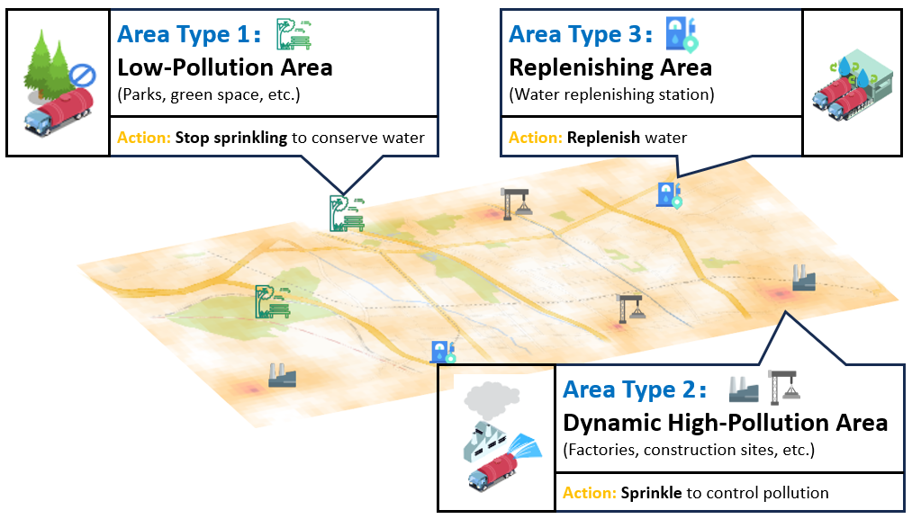
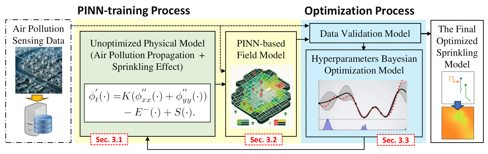

# SmartSpr: A Physics-informed Mobile Sprinkler Scheduling System for Urban Particulate Matter Pollution Reduction

## Authors
Ji Luo*, Zijian Xiao*, Zuxin Li, Xuecheng Chen, Chaopeng Hong, Xiao-Ping (Steven) Zhang, Xinlei Chen

## Introduction
Urban particulate pollution poses significant public health challenges, necessitating effective control mechanisms in cities worldwide. This paper introduces SmartSpr, a physics-informed urban mobile sprinkler scheduling system aimed at improving the effectiveness of particulate pollution reduction.

### Contributions
- **Physics-Informed Modeling**: Developed to quantify the impact of mobile sprinkling with a data-saving approach, leveraging sparse sensing data and adhering to physical laws to boost training efficiency.
- **Sparsity-Driven Scheduling**: Designed an adaptive scheduling strategy for the coordination of multiple sprinkling trucks.
- **Field & Simulation Experiments**: Conducted to gather real-world data for training, validating, and testing the SmartSpr system, alongside simulation experiments to evaluate the scheduling algorithms.

The repository is structured into two primary sections as discussed in the paper: **Physical Sprinkling Effect Modeling** and **Sparsity-Driven Decoupling Adaptive Sprinkler Scheduling**.

## Section 1: Physical Sprinkling Effect Modeling

### Environment Requirements
- Multi-CPU or Multi-GPU setup
- Operating Systems: Windows or Linux
- Python version: 3.8.16

### Quick Start Guide

1. Begin by opening and running `Bo.ipynb` to initiate a Bayesian Optimization loop for modeling the sprinkling effects. Detailed instructions are provided within the notebook.
2. After creating the training folder, execute the command:
```bash
python Sprinkle_Modeling/$device_num/train.py
```
to train the field model(PINN-training process).
3. Collect all results from the parallel device, then use `Bo.ipynb` for validation and to generate a new training folder. Repeat the training as needed(Optimization process).
4. Extract the best physical hyperparameters from `Bo.ipynb` and save them to `Sprinkle_PDE/info2.json` for use in the scheduling segment.

### Data Availability
The full dataset used in the paper is not currently open due to permission constraints. However, example data is made available in `Sprinkle_Modeling/Guicheng_data` to facilitate process walkthrough.

## Section 2: Sparsity-Driven Decoupling Adaptive Sprinkler Scheduling

### Environment Requirements
- Runs on Windows with CPU support
- Python version: 3.8.16

### Quick start
Refer to `Quick_start.ipynb` in the ipynb folder for detailed instructions.

### Bat file
We provide `strategy.bat` in the bat folder for batch running.

## Acknowledgement
We extend our appreciation to the following GitHub repositories, which provided valuable code base implementations:
https://github.com/Weizhe-Chen/PyPolo
